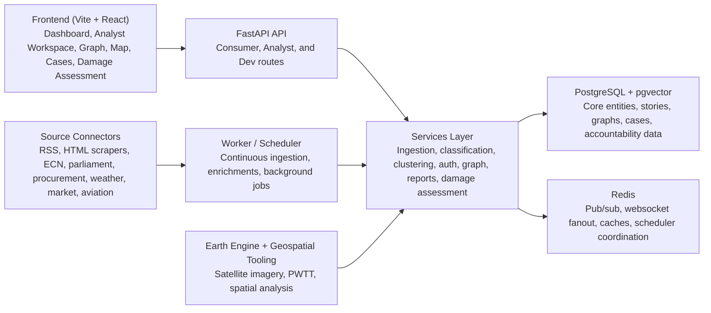
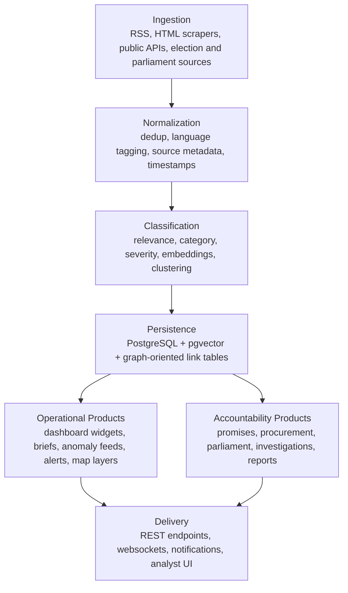

# Nepal OSINT Skeleton

Nepal OSINT Skeleton is a full-stack intelligence and public-interest monitoring platform for Nepal. It combines live ingestion, analyst workflows, accountability tooling, graph exploration, geospatial analysis, and a consumer-facing alert surface in one repo.

## What The System Covers

- Situational awareness: live news, disasters, weather, alerts, maps, market and energy feeds, aviation, seismic, river, and public-event monitoring.
- Accountability: manifesto promise tracking, procurement analysis, company and corporate intelligence, parliament and verbatim monitoring, fact-checking, editorial review, and peer verification.
- Analyst operations: cases, teams, watchlists, notes, review queues, hypotheses, unified graph exploration, multi-layer graph analysis, and trade intelligence.
- Geospatial operations: Earth Engine integrations, PWTT-based damage assessment, map layers, temporal analysis, drawing tools, and reports.
- Delivery: analyst workspace, dashboard, ops inbox, websocket updates, notifications, and consumer-safe endpoints.

## Product Architecture



## Core Operating Areas

### Accountability and Investigations

- `promises`: manifesto promise tracker and follow-through monitoring
- `procurement` + `procurement_analysis`: tender ingestion, risk scoring, and investigation workflows
- `companies`, `corporate`, `corporate_analytics`: registrations, ownership, beneficial links, and corporate intelligence
- `parliament` + `verbatim`: speeches, questions, bills, agendas, member performance, and transcript workflows
- `fact_check`, `peer_reviews`, `editorial`, `verification`: evidence review and publication controls
- `cases`, `investigation_cases`, `watchlists`, `notes`, `activity`: analyst case management and auditability

### Situational Awareness

- `stories`, `analytics`, `public_events`, `alerts`, `notifications`
- `disasters`, `disaster_alerts`, `weather`, `river`, `seismic`, `aviation`
- `market`, `energy`, `infrastructure`, `twitter`, `election_results`
- websocket feeds for near-real-time delivery to the dashboard

### Advanced Analyst Tooling

- `entities`, `graph`, `multi_layer_graph`, `unified_graph`, `unified_search`
- `trade`, `hypotheses`, `briefs`, `province_anomalies`, `tactical`, `anomalies`
- `damage_assessment`, `damage_assessment_v2`, `earth_engine`, `layers`, `drawing`, `temporal`, `reports`

## Roles and Access Model

- Consumer: can access the public-interest intelligence surface through authenticated, consumer-safe endpoints.
- Analyst: gets collaboration, cases, graph, spatial, trade, and investigative tooling.
- Dev: gets ingestion triggers, analysis utilities, ML controls, admin, and system operations routes.

The route split is implemented centrally in `backend-v5/app/api/v1/router.py`.

## Repo Layout

- `backend-v5`: FastAPI app, worker, migrations, config, geospatial services, scripts
- `agents`: top-level wrappers for local agent and maintenance entrypoints, delegating to `backend-v5`
- `frontend`: Vite + React UI for dashboard, analyst center, graph, map, investigations, trade, damage assessment
- `infrastructure`: deployment and ops assets
- `docker-compose.prod.yml`: production-oriented compose stack
- `Dockerfile`, `Dockerfile.prod`: container build definitions
- `alembic.ini`, `backend-v5/alembic`: schema migration wiring
- `backend-v5/config`: source registry and classification rules needed by local Docker runs

## Local Docker Quick Start

Prereqs:

- Docker Desktop or Docker Engine running locally

Run the full stack:

```bash
cd backend-v5
JWT_SECRET_KEY=dev-secret-change-me \
POSTGRES_PASSWORD=nepal_osint_dev \
APP_ENV=development \
FRONTEND_PORT=5173 \
docker compose up -d --build
```

Then open:

- Frontend: [http://127.0.0.1:5173](http://127.0.0.1:5173)
- API health: [http://127.0.0.1:8000/health](http://127.0.0.1:8000/health)

Stop the stack:

```bash
cd backend-v5
JWT_SECRET_KEY=dev-secret-change-me \
POSTGRES_PASSWORD=nepal_osint_dev \
APP_ENV=development \
docker compose down
```

## Important Contributor Notes

- The backend local stack depends on checked-in runtime assets under `backend-v5/config`, `backend-v5/alembic`, `backend-v5/app/data`, and `backend-v5/app/services/analyst_agent`.
- Docker migrations use `alembic upgrade heads` because the current Alembic graph has multiple heads. This avoids first-run failures on clean contributor machines.
- The repo vendors only the minimal runtime subset of PWTT under `backend-v5/pwtt_lib` so contributors can build the stack without cloning a separate large geospatial repo.
- No secrets, private keys, `.env` files, runtime databases, or deployment credentials should be committed here.

## How Data Moves Through The Platform



## Major Frontend Surfaces

Representative pages live under `frontend/src/pages`:

- dashboard and ops: `Dashboard.tsx`, `OpsInbox.tsx`, `AnalystCenter.tsx`
- accountability and investigations: `Investigation.tsx`, `ReviewQueue.tsx`, `AnalystReportsDesk.tsx`, `CandidateDossier.tsx`
- graph and entity intelligence: `Entities.tsx`, `GraphExplorer.tsx`, `GraphExplorerV2.tsx`, `KBEntities.tsx`
- geospatial and infrastructure: `MapView.tsx`, `DamageAssessment.tsx`, `SatelliteAnalysis.tsx`
- elections and trade: `Elections.tsx`, `TradeAnalysis.tsx`, `Indices.tsx`

## Backend Surface Area

Representative API modules live under `backend-v5/app/api/v1`:

- platform core: `stories`, `analytics`, `auth`, `notifications`, `public_events`
- accountability: `promises`, `procurement`, `procurement_analysis`, `companies`, `corporate`, `corporate_analytics`, `parliament`, `verbatim`, `fact_check`
- investigations and collaboration: `cases`, `investigation_cases`, `watchlists`, `notes`, `activity`, `peer_reviews`, `verification`, `editorial`
- advanced operations: `graph`, `multi_layer_graph`, `unified_graph`, `trade`, `briefs`, `province_anomalies`, `tactical`, `damage_assessment`, `earth_engine`

## Current Local Validation

This repo was validated from a clean external clone outside the original working folder. The local Docker stack was brought up successfully with:

- frontend reachable on port `5173`
- backend health check returning healthy on port `8000`
- local guest auth flow working against the local API

The worker also starts successfully after rebuilding from the corrected source tree.
